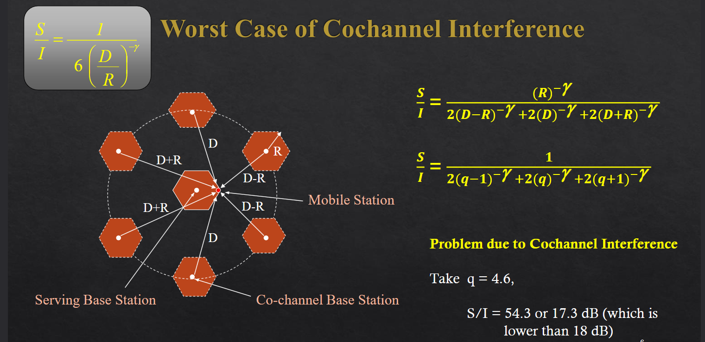
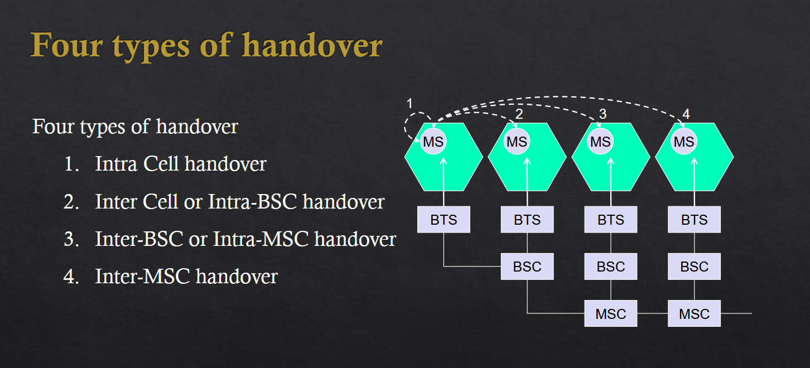
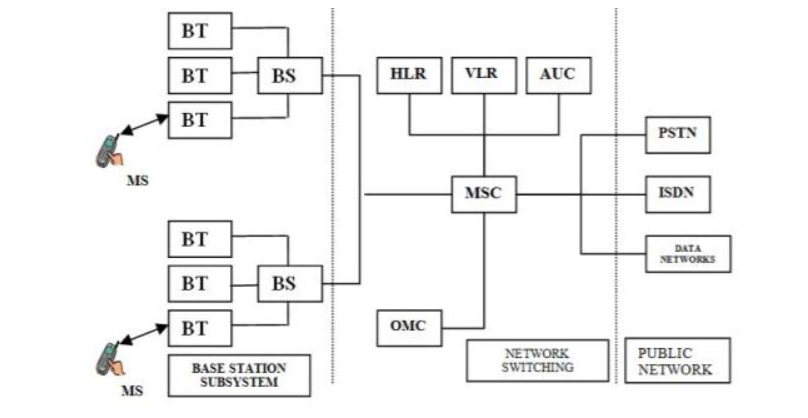

# LetsShare

**Peer-to-peer file sharing, straight from the browser — no cloud storage, no accounts, no size limits.**

LetsShare moves files directly between two browsers using **WebRTC**. A lightweight signaling server only helps two browsers find each other; once connected, every byte of your files travels directly from sender to receiver. The server never sees, stores, or proxies your data.

The project ships as **two independent apps** that share a common UI/logic library:

| App | Use case | How people connect |
|---|---|---|
| **Internet** | Send a file to anyone, anywhere | Share a generated link via chat, email, etc. |
| **LAN** | Share files with everyone on your local network | Auto-discovery lobby — no links needed |

---

## How it works

```
   Sender                  Signaling Server                 Receiver
     |                    (Express + Socket.io)                |
     | 1. Create session  ─────────────────────►               |
     |                     2. Exchange WebRTC offer/answer       |
     |  ◄──────────────────────────────────────► |
     |                                                          |
     | 3. Direct P2P connection established (WebRTC DataChannel) |
     |═══════════════════════════════════════════════════════►|
     |              File transferred directly, encrypted         |
```

1. The **signaling server** is only used to exchange connection details (SDP offers/answers and ICE candidates) — a brief handshake.
2. Once both sides establish a **WebRTC DataChannel**, the file transfers **directly between browsers**, end-to-end encrypted (DTLS).
3. The server's job is done after the handshake. It never touches file contents.

---

## Internet mode

Generate a shareable link, send it to anyone, and they can download your files the moment they open it — no signup, no app install.

**Flow:**
1. Open the **Send** page, select files.
2. A unique link is generated (e.g. `https://yourapp.com/receive?id=abc123`).
3. Share that link with the recipient through any channel — chat, email, SMS.
4. They open the link, the WebRTC handshake happens automatically, and the transfer starts.

### How to use it

<!-- TODO: Replace with actual screenshot of the Send page -->


<!-- TODO: Replace with actual screenshot of the generated share link -->


<!-- TODO: Replace with actual screenshot of the Receive page -->


<!-- TODO: Replace with actual screenshot of a completed transfer -->


---

## LAN mode

Designed for sharing files across a local network — home, office, classroom, conference — without needing internet access at all. Everyone connects to the same local server and sees a live "lobby" of who's online and what's being shared.

**Flow:**
1. Anyone on the network opens `http://letshare.local` (or the host machine's LAN IP).
2. They pick a display name and enter the **Lobby**.
3. To share, go to the **Share** tab, select files/folders, choose access mode (**Open** or **PIN-protected**), and announce.
4. Everyone else in the lobby instantly sees the new share appear as a card.
5. To download, click a share card in the **Lobby** tab (entering the PIN if required), then watch live transfer stats in the **Download** tab.

mDNS (`letshare.local`) means no IP addresses need to be shared manually — though the lobby also displays the host's IP as a fallback for devices that don't support `.local` resolution (e.g. some Android devices).

### How to use it

<!-- TODO: Replace with actual screenshot of the name-entry screen -->


<!-- TODO: Replace with actual screenshot of the Lobby tab showing active shares -->


<!-- TODO: Replace with actual screenshot of the Share tab with file picker and access mode -->


<!-- TODO: Replace with actual screenshot of the PIN entry modal -->


<!-- TODO: Replace with actual screenshot of the Download tab with live transfer stats -->


---

## Project structure

```
letshare/
├── packages/core/        Shared UI components, hooks, and utilities
├── apps/
│   ├── internet/
│   │   ├── frontend/      React app — Send/Receive pages
│   │   └── backend/        Signaling server (Express + Socket.io)
│   └── lan/
│       ├── frontend/       React app — Lobby, Share, Download tabs
│       └── backend/         Signaling server + mDNS advertisement
└── docker-compose.yml      Orchestrates all four services
```

See [`STRUCTURE.md`](./STRUCTURE.md) for the full file-by-file breakdown.

---

## Running locally (without Docker)

### Prerequisites

- **Node.js `24.14.0`** (see `.nvmrc` — run `nvm use` if you have nvm installed)
- npm `>=10`

### 1. Install dependencies

From the monorepo root — this installs all workspaces (`packages/core` + all four apps) in one go:

```bash
npm install
```

### 2. Set up environment files

Copy the example env files for each app:

```bash
cp apps/internet/backend/.env.example  apps/internet/backend/.env
cp apps/internet/frontend/.env.example apps/internet/frontend/.env
cp apps/lan/backend/.env.example       apps/lan/backend/.env
cp apps/lan/frontend/.env.example      apps/lan/frontend/.env
```

The defaults work out of the box for local development — no edits required to get started.

### 3. Run the Internet app

```bash
npm run dev:internet
```

This starts both the backend (port `3001`) and frontend (port `5173`) concurrently.
Open **http://localhost:5173**.

### 4. Run the LAN app

```bash
npm run dev:lan
```

This starts the LAN backend (port `3002`, with mDNS advertisement) and frontend (port `5174`) concurrently.
Open **http://localhost:5174**, or from another device on the network: **http://letshare.local:5174** (or the host's LAN IP).

> You can run both apps at the same time — they use different ports and don't conflict.

---

## Running with Docker

Docker Compose builds and runs every service — frontend and backend, for both apps — with separate **development** and **production** configurations.

### Prerequisites

- Docker Engine `24+`
- Docker Compose v2 (`docker compose`, not `docker-compose`)

### 1. Set up environment

```bash
cp .env.example .env
```

Edit `.env` to set your production domain/IP if deploying — for local testing the defaults are fine.

### 2. Development mode

Runs all containers with **hot-reload** (Vite HMR for frontends, nodemon for backends). Source code is bind-mounted, so your local edits apply instantly without rebuilding images.

```bash
# Everything (internet + LAN)
docker compose --profile dev up

# Just the internet app
docker compose --profile dev-internet up

# Just the LAN app
docker compose --profile dev-lan up
```

| Service | URL |
|---|---|
| Internet frontend | http://localhost:5173 |
| Internet backend | http://localhost:3001 |
| LAN frontend | http://localhost:5174 |
| LAN backend | http://localhost:3002 |

### 3. Production mode

Builds optimized images — Vite production builds served via nginx for frontends, lean Node.js images for backends.

```bash
# Everything
docker compose --profile prod up --build

# Just the internet app
docker compose --profile prod-internet up --build

# Just the LAN app
docker compose --profile prod-lan up --build
```

| Service | URL |
|---|---|
| Internet frontend | http://localhost (port 80) |
| Internet backend | http://localhost:3001 |
| LAN frontend | http://localhost:8080 |
| LAN backend | http://localhost:3002 |

> **mDNS in Docker:** For the LAN backend to advertise `letshare.local` on your actual network, it needs `network_mode: host`, which only works on Linux. On macOS/Windows, either run the LAN backend natively (`npm run dev:lan` from the host) or access it via the container's published port/IP instead of the `.local` hostname. See `docker-compose.yml` for details.

### 4. Stopping containers

```bash
docker compose --profile dev down
# or
docker compose --profile prod down
```

Add `-v` to also remove the named volumes (`node_modules` caches):

```bash
docker compose --profile dev down -v
```

---

## Tech stack

- **Frontend:** React 19, Vite 7, Tailwind CSS v4, React Router v7
- **Backend:** Node.js 24, Express 4, Socket.io 4
- **Transport:** WebRTC (DataChannel), Bonjour/mDNS (LAN discovery)
- **Monorepo:** npm workspaces

---

## License

Add your license here.